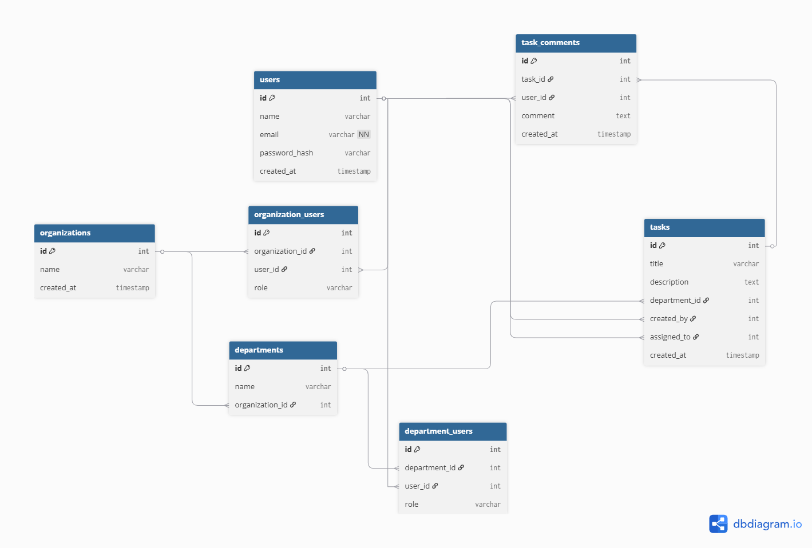

# Secure Task Management System

The **Secure Task Management System** is a full-stack application built using a modern **NX monorepo** architecture.  
It combines a **NestJS backend (API)**, an **Angular frontend (Dashboard)**, and a **PostgreSQL database** running inside Docker.  
The system enforces **role-based access control (RBAC)** at both the **organization** and **department** levels, ensuring that tasks can only be created, viewed, or modified by authorized users based on their role.

This project demonstrates **enterprise-level security patterns** (authentication, RBAC, modular architecture, audit logging) combined with a **modern, responsive frontend**.

---

## Project Structure

The repository follows the NX monorepo approach, which allows managing multiple apps and shared libraries under one workspace:

```
apps/
  api/            → NestJS backend (JWT Auth, RBAC, REST API)
  dashboard/      → Angular frontend (Task dashboard, TailwindCSS)
libs/
  data/           → Shared DTOs & TypeScript interfaces
  auth/           → Reusable RBAC decorators, guards, and JWT strategy
```

- **apps/api** → Provides RESTful API endpoints for authentication, organizations, departments, tasks, and comments. It includes RBAC guards and audit logging.  
- **apps/dashboard** → A responsive Angular web app styled with TailwindCSS. It connects to the API, provides login, and allows users to interact with tasks and departments based on their role.  
- **libs/data** → Stores common DTOs (Data Transfer Objects) and TypeScript interfaces. Both backend and frontend use this library to remain consistent and type-safe.  
- **libs/auth** → Encapsulates the RBAC system. It contains JWT authentication logic and guards that enforce access rules.  

This structure keeps the system modular: security is reusable, data models are shared, and each app is isolated but consistent.

---

## Data Models

The system revolves around a **multi-level organizational structure**:

- **User** → The individual interacting with the system. A user can belong to multiple organizations and departments.  
- **Organization** → The top-level grouping. Each organization contains multiple departments and has an owner who controls access.  
- **Department** → A subdivision within an organization. Each department can have its own users and tasks.  
- **Task** → The main resource. Tasks belong to departments, and access to them depends on the user’s role.  
- **TaskComment** → A comment left on a task. Visibility and permissions depend on the user’s role.  
- **OrganisationUser / DepartmentUser** → These join tables define *what role a user has in a given organization or department*.  

### Roles
- **Owner** → Has the highest authority within an organization. Can manage users, departments, tasks and task comments.  
- **Admin** → Manages tasks and department members. Has elevated rights but cannot override the organization owner.  
- **Viewer** → Read-only access. Can see tasks and comments but cannot create or modify them.  

### Role Inheritance
The roles follow a **hierarchy**:
```
Owner > Admin > Viewer
```
An **Owner** inherits all permissions of Admins and Viewers as well us complete access to org.  
An **Admin** inherits Viewer permissions as well as complete access to department.  
A **Viewer** can only observe.  

This inheritance simplifies access control: higher-level roles automatically gain lower-level permissions.

---

## Authentication & Access Control

The system uses **JWT (JSON Web Tokens)** for authentication.  

1. A user logs in with their credentials.  
2. The API returns a signed JWT, which contains the user’s ID and role assignments.  
3. All subsequent requests must include this token in the `Authorization: Bearer <token>` header.  
4. NestJS  check whether the user has the correct role and belongs to the relevant organization/department before allowing access.  


---


## API Documentation

### Authentication

**Login**  
`POST http://localhost:3000/api/users/login`  

**Request**
```json
{
  "email": "donbasilpeter@gmail.com",
  "password": "1234567"
}
```

**Response**
```json
{
  "access_token": "eyJhbGciOiJIUzI1NiIsInR5cCI6IkpXVCJ9...",
  "user": {
    "id": 1,
    "name": "don",
    "email": "donbasilpeter@gmail.com"
  }
}
```

---

### Organisations

**Create Organisation**  
`POST http://localhost:3000/api/organisations`  

**Request**
```json
{
  "name": "My First Organisdation"
}
```

**Response**
```json
{
  "name": "My First Organisdation",
  "id": 10,
  "createdAt": "2025-09-21T03:47:43.761Z",
  "role": "owner"
}
```

---

### Departments

**Create Department**  
`POST http://localhost:3000/api/departments`  

**Request**
```json
{
  "name": "EngineerifdghDng",
  "organisationId": 1
}
```

**Response (Error if user is not part of organisation)**
```json
{
  "message": "User is not part of this organisation",
  "error": "Not Found",
  "statusCode": 404
}
```

---

## Frontend (Angular + TailwindCSS)

The frontend provides a **user-friendly dashboard** for interacting with the system.

### Key Features
- **Authentication UI** → A login page where users enter credentials. On success, the JWT is stored in localStorage and attached to API requests.  
- **Organization and Department Pages** → Displays the hierarchy and role assignments. The UI adapts to the user’s role, hiding actions they cannot perform.  
- **Task Management** → Users can create, delete, or view tasks depending on permissions. Tasks are displayed in categories (e.g., Work, Personal).  
- **Task Comments** → A modal allows users to view or add comments to a task. Permissions control whether they can add or only view.  
- **Responsive Layout** → Built with TailwindCSS, ensuring the UI looks good on mobile, tablet, and desktop.  

By combining **Angular Signals/Store** for state management and Tailwind for styling, the dashboard is responsive, efficient, and visually appealing.

---

## Setup & Run

### Prerequisites
- Install **Node.js 20+**  
- Install **Nx CLI** (`npx install -g nx`)  
- Install **Docker & Docker Compose**  

---

### Start Database with Docker Compose

The project includes a `docker-compose.yml` file that sets up **Postgres** and **pgAdmin**.  
Start the services with:

```bash
docker-compose up -d
```

- **Postgres** → Runs on `localhost:5432`  
- **pgAdmin** → Access via [http://localhost:5050](http://localhost:5050)  
  - Default login: `admin@admin.com / admin`  

---

### Configure Environment Variables

In the root folder, rename the sample.env file  to  .env

```env
DB_HOST=localhost
DB_PORT=5432
DB_USER=postgres
DB_PASS=postgres
DB_NAME=taskdb
JWT_SECRET=ada46f80394a5bc26bff630db800d9f6
JWT_EXPIRES=3600s
APP_URL = http://localhost:4200
```

---

### Install Dependencies & Run Apps

```bash
# Install all dependencies
npm install

# Run backend (NestJS API)
nx serve api

# Run frontend (Angular Dashboard)
nx serve dashboard
```

The backend will connect to Postgres, and the frontend will be accessible via `http://localhost:4200`.

---

## Architecture Overview

The system is built with **scalability and security** in mind:

- **NX Monorepo** → A single workspace with isolated apps and shared libraries.  
- **Separation of Concerns** → Backend (API), frontend (Dashboard), and shared libs (`auth`, `data`).  
- **RBAC Implementation** → Role based access to different endpoints.  
- **Shared Data Contracts** → DTOs/interfaces in `libs/data` ensure backend and frontend stay in sync.  
- **Modular Design** → New roles, permissions, or modules can be added with minimal impact on existing code.  
This approach ensures clean code separation, easy maintainability, and readiness for production environments.


### ER Diagram 



---

## Future Enhancements

The system already covers core security and task management features, but can be extended with:

- **Caching Permission Checks** → Improving performance under heavy load.  
- **GraphQL API** → Offering more flexible queries for frontend clients.  
- **Multi-Factor Authentication (MFA)** → Add an extra layer of login security using email, SMS, or authenticator apps.  
- **Advanced Role Delegation** → Allow Owners to define custom roles and permissions beyond Owner/Admin/Viewer.  
- **Task Dependencies** → Prevent certain tasks from starting until prerequisite tasks are complete.  
- **File Attachments** → Allow uploading and managing files within tasks.  


---

## License

MIT License © 2025 — Secure Task Management System  
